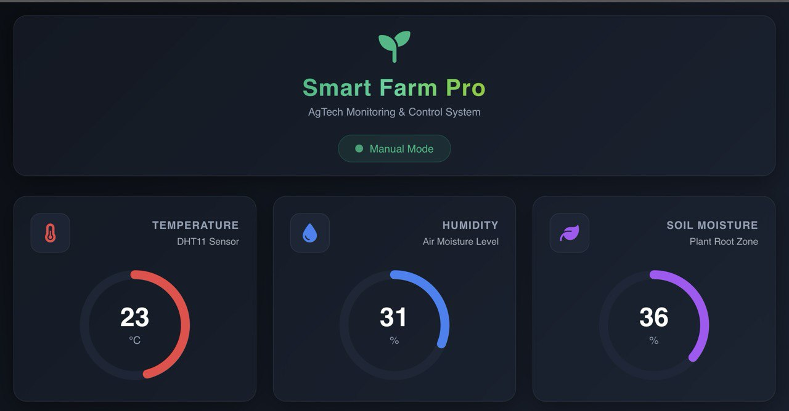
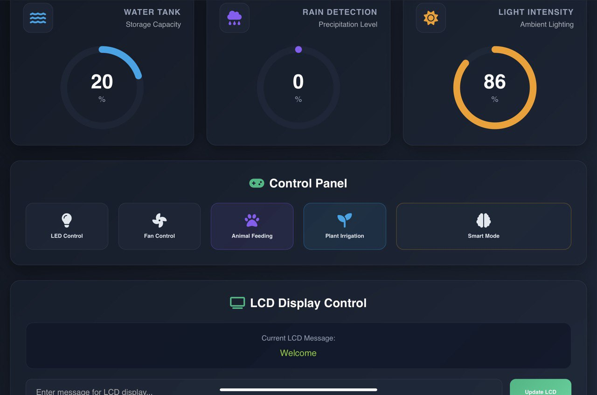

# Smart Farm Pro | IoT Agricultural Monitoring & Control System

**An advanced, ESP32-based IoT solution for autonomous farm management, featuring real-time environmental monitoring and a modern web-based control interface.**

---

## Project Demonstrations
| Smart Mode (Autonomous) | Manual Control (User Interface) |
| :---: | :---: |
|  |  |

---

## System Overview
The dashboard features a modern Glassmorphism UI, providing a seamless monitoring and control experience across all devices.

*Real-time data visualization and hardware override interface.*
---

## Operation Modes

### Smart Mode (Autonomous)
In this mode, the system acts as an independent decision-maker based on pre-defined thresholds:
* **Precision Irrigation:** Automatically triggers the water pump (Relay) when soil moisture drops below the dry threshold.
* **Climate Regulation:** Activates the cooling fan using **Soft Start PWM** logic when temperatures exceed the limit to prevent inrush current spikes.
* **Livestock Feeding:** Uses an Ultrasonic sensor to detect animal presence within 5cm, triggering a Servo-based dispenser.
* **Adaptive Lighting:** LDR-based ambient light monitoring for automated supplemental plant lighting.
* **Security System:** PIR-based motion tracking with a multi-tone siren for site security.

### Manual Mode (Override)
Provides the user with direct control via the Web Dashboard, bypassing the autonomous logic:
* **Direct Actuator Control:** Toggle LEDs, fans, pumps, and feeding mechanisms instantly from the web interface.
* **Site Communication:** Broadcast custom text messages to the physical 16x2 I2C LCD screen.
* **Hardware Override:** A dedicated hardware button (`PHYS_BTN`) for immediate manual lighting control regardless of software state.

---

## Hardware Architecture
| Component | Function |
| :--- | :--- |
| **ESP32** | Central MCU & Local Access Point |
| **DHT11** | Ambient Temperature & Humidity Monitoring |
| **HC-SR04** | Ultrasonic Proximity Sensing for Feeding |
| **PIR Sensor** | Infrared Motion Detection for security |
| **I2C LCD** | Real-time Status & IP Address Display |
| **Relay/Servo/Fan** | Environmental Actuators for farm maintenance |

---

## Software Design & Engineering
The firmware follows the **Separation of Concerns (SoC)** principle for modularity:
* **Config.h**: Centralized pin mapping and environment thresholds.
* **FarmLogic.cpp**: Encapsulated automation algorithms and hardware-specific logic.
* **Non-blocking Execution**: Utilizes `millis()` based timers to ensure the Web Server remains responsive during sensor polling.
* **Asynchronous Updates**: The dashboard uses a JSON API to fetch sensor data every 1500ms without full page reloads.

---

## Setup & Installation
1. Clone this repository.
2. Set your WiFi credentials in `Config.h`.
3. Required Libraries: `ESP32Servo`, `LiquidCrystal_I2C`, `dht11`.
4. Flash the code to your ESP32 and connect to the IP address shown on the LCD.
